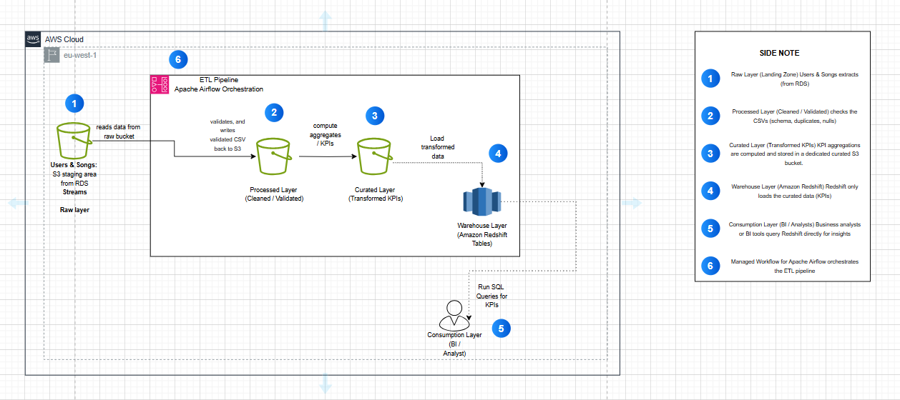

# End-to-End ETL Data Pipeline with Apache Airflow and Amazon Redshift for a Music Streaming Service

## Overview

End-to-end ETL data pipeline with Apache Airflow to ingest metadata from CSV (RDS simulation) and streaming data from Amazon S3, transform and validate it, and load into Amazon Redshift to compute KPIs for music streaming analytics and business intelligence.

## Project Description

This project demonstrates an end-to-end ETL data pipeline for a music streaming service, orchestrated with Apache Airflow (MWAA). The pipeline:

- Ingests user and song metadata from CSV (RDS simulation) and streaming event data from Amazon S3
- Validates and transforms raw data into analytics-ready tables
- Loads data into Amazon Redshift using an Upsert strategy for efficiency
- Computes KPIs such as genre-level metrics (listen counts, popularity index, average track duration) and hourly insights (unique listeners, top artists, track diversity)

The pipeline supports business intelligence, and user behavior analytics, reflecting a practical modern data engineering with Airflow, S3, and Redshift.

## Architecture

### ETL Pipeline Design with Apache Airflow and Amazon Redshift


## Setup & Running the ETL Pipeline with Airflow & Redshift

### Prerequisites

Make sure you have these installed and configured before running the project:

- Python 3.8+
- AWS account signed in as an IAM user
- Apache Airflow (MWAA or local Airflow environment)
- Amazon Redshift cluster (with database & tables set up)
- S3 bucket (for staging streaming data)

### Installation

1. **Clone the repository:**
   ```bash
   git clone https://github.com/Eugenia-DE/music-etl-airflow-redshift.git
   cd music-etl-airflow-redshift
   ```

2. **Install dependencies:**
   ```bash
   pip install -r requirements.txt
   ```

### Configuration

1. **Update config.py with:**
   - S3 bucket name
   - Redshift connection details
   - IAM role ARN for Redshift COPY

2. **Set Airflow Variables (via UI or CLI) for connection strings.**

### Running the Pipeline

#### 1. Deploy the DAG to MWAA
- Copy the DAG file (`music_streaming_pipeline_mwaa_v7_dag.py`) into your MWAA environment's `dags/` folder.
- MWAA will automatically detect new DAGs in that folder.

#### 2. Trigger the DAG
- Open the Airflow UI (from your MWAA environment in AWS).
- Turn on the toggle (to enable scheduling).

**Either:**
- Let it run automatically (every hour, as defined by `@hourly` schedule interval), or
- Trigger it manually using the **Trigger DAG** button.

#### 3. Monitor the Execution
- In the Airflow UI, check the **Graph View** or **Gantt View**.
- The pipeline consists of the following tasks:
  - `extract_data` → pulls raw + dimension data from S3
  - `validate_data` → validates and cleans event batches (mapped dynamically per batch)
  - `transform_and_compute_kpis` → computes KPIs and enriches data (also mapped dynamically)
  - `load_data` → combines all results and loads them into Redshift
- Failed tasks can be retried directly from the UI.

#### 4. Verify Results
- KPIs should be available in the Redshift fact tables you configured.
- You can query them in Redshift to validate data load.

### Resetting the S3 Stream Marker

The project includes a utility DAG (`reset_s3_stream_marker_utility.py`) designed to reset the processing marker used by the main ETL pipeline.

#### What It Does
- Resets the S3 stream marker to the epoch (0 / beginning of time).
- The main pipeline will then:
  - Treat both stream and static data.
  - Reprocess every historical file (full backfill).
  - Reload KPIs into Redshift.

#### How to Run It
- Deploy the DAG (`reset_s3_stream_marker_utility.py`) to your MWAA `dags/` folder.
- In the Airflow UI: Locate the DAG: `reset_s3_stream_marker_to_epoch_utility`.
- Trigger it manually.
- Once it completes: The next run of `music_streaming_etl_pipeline_v7` will start processing all historical data from S3.

**Note:** Resetting will reload both stream and static data. For fixed datasets (users/songs), this is redundant but safe. Run reset only when you need a full historical rebuild. Otherwise, just keep triggering the main DAG.

## Project Structure

### ETL Modules

This project uses modularized Python scripts that contain the core ETL logic.  
These modules are imported by the Airflow DAG and **are not meant to be run directly**.

- **extract_module.py**  
  Handles extraction of new streaming events from S3 Raw and static dimension data (users, songs).  
  Saves processed outputs in S3 Processed and returns S3 keys for downstream tasks.

- **validate_module.py**  
  Cleans and validates streaming event batches. Ensures schema and data quality before transformation.

- **transform_module.py**  
  Enriches validated data with dimensions and computes KPIs (e.g., streams per user, top songs).  
  Stores results in the KPI S3 bucket.

- **load_module.py**  
  Loads aggregated KPI data into Amazon Redshift fact tables for analytics.  
  Ensures incremental loads based on processing markers.

### Utility Modules

In addition to the main ETL modules, the project includes utility scripts that provide common helper functions.  
These are used across multiple ETL stages and help keep the main DAG logic clean and modular.

- **s3_utils.py**  
  Provides helper functions for interacting with Amazon S3.  
  Includes utilities for reading/writing files, checking object existence, listing bucket contents, and managing markers for incremental processing.  
  Used mainly in the **extract** and **validate** stages.

- **redshift_utils.py**  
  Provides helper functions for working with Amazon Redshift.  
  Includes utilities for connecting to Redshift, loading data into fact tables, and handling incremental upserts.  
  Used mainly in the **load** stage of the pipeline.